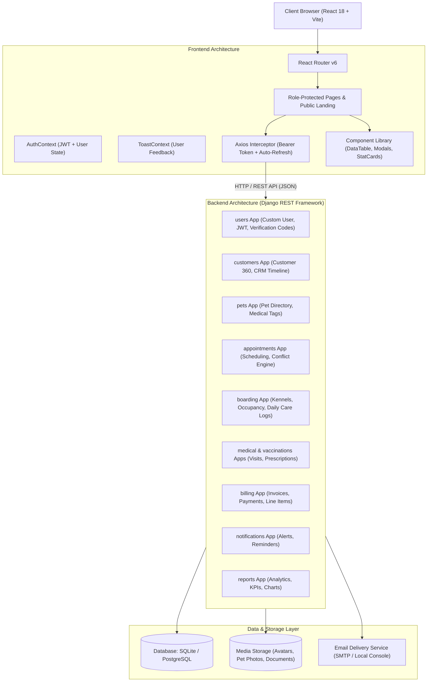
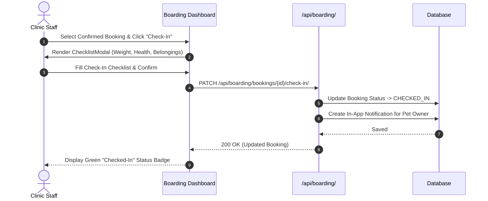

# Pet Care CRM — Architecture Documentation

This document describes the architectural design, business domains, data flow, security model, and structural boundaries of the **Pet Care CRM & Sanctuary Management System**.

---

## 1. System Overview

Pet Care CRM is a multi-tenant-capable, role-based commercial web application tailored for veterinary clinics, boarding sanctuaries, pet grooming salons, and daycare facilities.

### Technology Stack
* **Frontend:** React 18, Vite, React Router DOM v6, Tailwind CSS, Lucide Icons, Recharts.
* **Backend:** Python 3.13, Django 5.x, Django REST Framework (DRF), SimpleJWT.
* **Database:** SQLite (Development) / PostgreSQL (Production ready).
* **Communication & Verification:** Django EmailMultiAlternatives (SMTP / Console fallback), Web Push Notifications, REST APIs over JSON.

---

## 2. High-Level Architecture Diagram

---

## 3. Backend App Domains & Responsibilities

The Django backend is decoupled into 11 specialized applications:

| App | Responsibility | Key Models |
| :--- | :--- | :--- |
| `users` | Custom user accounts, role hierarchy (`ADMIN`, `STAFF`, `CUSTOMER`), authentication tokens, 2FA sign-in sessions, and registration email verification codes. | `User`, `VerificationCode`, `LoginVerification`, `EmailVerificationToken` |
| `customers` | Pet owner profiles, CRM interaction timeline (Calls, Emails, In-Person visits), cumulative booking stats, and lifetime spend tracking. | `Customer`, `CustomerInteraction` |
| `pets` | Pet identities, species categorization (Dog, Cat, Bird, Exotic), microchips, dietary routines, personality traits, and emergency hospital protocols. | `Pet` |
| `services` | Service catalog (Boarding, Grooming, Daycare, Training, Vet Exam), base pricing, durations, and capacity metrics. | `Service` |
| `appointments` | Scheduling engine with automated staff double-booking conflict prevention, calendar views, and status workflows (`PENDING`, `CONFIRMED`, `COMPLETED`, `CANCELLED`). | `Appointment` |
| `boarding` | Room/kennel suite management (Standard, Premium, Luxury, Daycare Playpens), interactive digital check-in protocols (condition, weight, belongings), check-out verification, and the **Pet Digital Diary** recording arrival intake ("When Pet Came"), daily stay activities (feeding, walks, playtime, medication, photo updates), and departure farewell ("When Pet Leaves"). | `Room`, `BoardingBooking`, `BoardingChecklist`, `DailyCareLog` |

| `medical` | Veterinary medical visits, treatment plans, prescriptions, medication administration schedules, and dietary meal tracking. | `MedicalVisit`, `Medication` |
| `vaccinations` | Vaccination history, batch numbers, automated validity/expiry calculation (`VALID`, `EXPIRING_SOON`, `EXPIRED`), and booking safety warnings. | `Vaccination` |
| `billing` | Financial invoice generation, line items calculation, tax rates, percentage discounts, payment recording, and browser printable receipts. | `Invoice`, `InvoiceItem`, `Payment` |
| `notifications` | System alerts, upcoming appointment reminders, vaccine expiration alerts, and in-app bell notifications. | `Notification` |
| `reports` | Business intelligence metrics: monthly revenue trends, appointment distributions, kennel occupancy percentages, and service popularity charts. | Pure analytical aggregations (no persistent models) |

---

## 4. Authentication, Authorization & Security Architecture

### Role-Based Access Control (RBAC)
User permissions follow a strict three-tier hierarchy:
1. **`ADMIN`:** Full CRM system privileges, administrative controls, staff account management, financial reports, invoice deletion, and global settings.
2. **`STAFF`:** Daily clinic operations, boarding check-in/out, appointment status updates, daily care logs, pet medical logs, and vaccination records. Restricted from staff management and financial deletions.
3. **`CUSTOMER`:** Self-service portal access restricted strictly to their own pets, appointment bookings, boarding stays, invoices, and profile.

### Authentication Pipelines
1. **Customer Registration with Secure Email Verification ("Yes, It's Me"):**
   * Customer enters registration details (`first_name`, `last_name`, `email`, `phone`, `password`) on `/register`.
   * Backend `RegisterSerializer` creates the account with `is_email_verified = False` and creates a linked `Customer` record.
   * A cryptographically secure, random 48-byte URL-safe (64-character) `EmailVerificationToken` is generated with a strict 30-minute expiration window.
   * A verification email is dispatched to the user's exact email address with subject *"Verify your email address"* and prominent **[ YES, IT'S ME ]** button pointing to `/api/auth/verify-email/?token=...`.
   * The user clicks "YES, IT'S ME", opening the verification URL handled by the backend:
     * Backend validates token existence, unexpired validity (`now <= expires_at`), and single-use status (`is_used == False`).
     * Confirms identity against `token.user.email`.
     * Marks `user.is_email_verified = True` and immediately invalidates the token (`token.is_used = True`).
     * Returns spec success message: *"Email verified successfully. You can now continue using your account."*
     * Invalid or re-used tokens return HTTP 400: *"This verification link is invalid or has expired. Please request a new verification email."*
   * Rate-limited resend endpoint (`/api/auth/resend-verification/`) enforces 60-second cooldown and anti-enumeration defenses.
   * Unverified customer logins are blocked with HTTP 403 (`requires_email_verification: true`).
2. **Sign-In Confirmation (Gmail "Yes, It's Me"):**
   * Password verified against Django password hasher (PBKDF2 SHA256).
   * Generates a 15-minute `LoginVerification` session token.
   * Dispatches an email to the user's Gmail with a "Yes, It's Me" approval link.
   * Frontend polls or user approves via link, issuing SimpleJWT Access & Refresh tokens.

---

## 5. Frontend Architecture & Design System

### State Management & Contexts
* **`AuthContext`:** Manages user session, JWT storage in `localStorage`, user role determination (`isAdmin`, `isStaff`, `isCustomer`), and automatic user profile rehydration.
* **`ToastContext`:** Global notification toaster providing unified feedback banners (`success`, `error`, `info`, `warning`).
* **Axios API Client (`api.js`):** Centralized HTTP client configured with baseURL `http://127.0.0.1:8000/api`. Injects `Authorization: Bearer <token>` automatically on every request and intercepts 401 errors to refresh access tokens seamlessly.

### Design System & Theme
* **Color Palette:**
  * Forest Teal / Emerald: `#0d9488` / `#0f766e` (Primary brand action & verification badges)
  * Deep Slate: `#0f172a` / `#1e293b` (Sidebar, dark surfaces, high-contrast text)
  * Warm Sand / Amber: `#fef3c7` / `#d97706` (Warnings, pending check-ins, attention badges)
  * Rose Crimson: `#f43f5e` (Cancellations, expired vaccines, destructive actions)
* **Typography:** Modern sans-serif typography with monospace tracking for verification codes and invoice identifiers.

---

## 6. Core Business Workflows

### Digital Boarding Check-In & Check-Out

### Pet Boarding Digital Diary Architecture (Arrival, Daily Stay & Departure)
Each pet receiving boarding services has a dedicated **Pet Digital Diary** (`DailyCareLog`) tracking their entire sanctuary journey across three core lifecycle stages:
1. **Stage 1: Arrival & Intake (`ARRIVAL` - "When Pet Came"):**
   * Automatically generated upon digital check-in completion in `BoardingChecklistView`.
   * Captures arrival timestamp, intake weight (kg), personal belongings received (leash, favorite toys, food bag), vaccination verification, and welcome inspection notes.
2. **Stage 2: Daily Stay Activities (`DAILY`):**
   * Real-time logging of daily care activities: `FEEDING`, `EXERCISE`, `WALK`, `MEDICATION`, `GROOMING`, `POTTY`, `BEHAVIOR`, `HEALTH_CHECK`, and `PHOTO`.
   * Rich mood & energy categorization (`HAPPY`, `PLAYFUL`, `CALM`, `AFFECTIONATE`, `SHY`, `ANXIOUS`, `SLEEPY`).
   * Activity headlines, dietary appetite notes, medical administration logs, and attached photos.
   * Auto-syncs attached photos to `boarding_booking.stay_photo` for live display on customer portal.
3. **Stage 3: Departure & Checkout (`DEPARTURE` - "When Pet Leaves"):**
   * Automatically generated upon digital check-out completion in `BoardingChecklistView`.
   * Records departure timestamp, exit physical condition (clean, energized, healthy), confirmation of all personal belongings returned to owner, and checkout farewell notes.
4. **Pet Report Card & Diary Export:**
   * Browser-printable veterinary report card & stay diary certificate formatted for owners to keep.

---

## 6. Active Service Client Dashboard Isolation Policy

To maintain clean executive metrics and operational clarity for sanctuary administrators:
- **Casual Account Exclusion:** Customers who merely register, log in, or create a pet profile without booking services (appointments, boarding stays, or invoices) are excluded from the Admin Dashboard.
- **Service Scoping:** `DashboardSummaryView` strictly queries clients and pets using `Q(appointments__isnull=False) | Q(boarding_bookings__isnull=False) | Q(invoices__isnull=False)`.
- **UI Exposure:** The Admin Dashboard features a dedicated **"Clients Receiving Pet Services"** directory alongside the Boarding Guest photo manager, surfacing only clients with active/past pet care services.
- **Filtering Support:** `/api/customers/` and `/api/pets/` support `has_services=true` for consistent downstream filtering.
